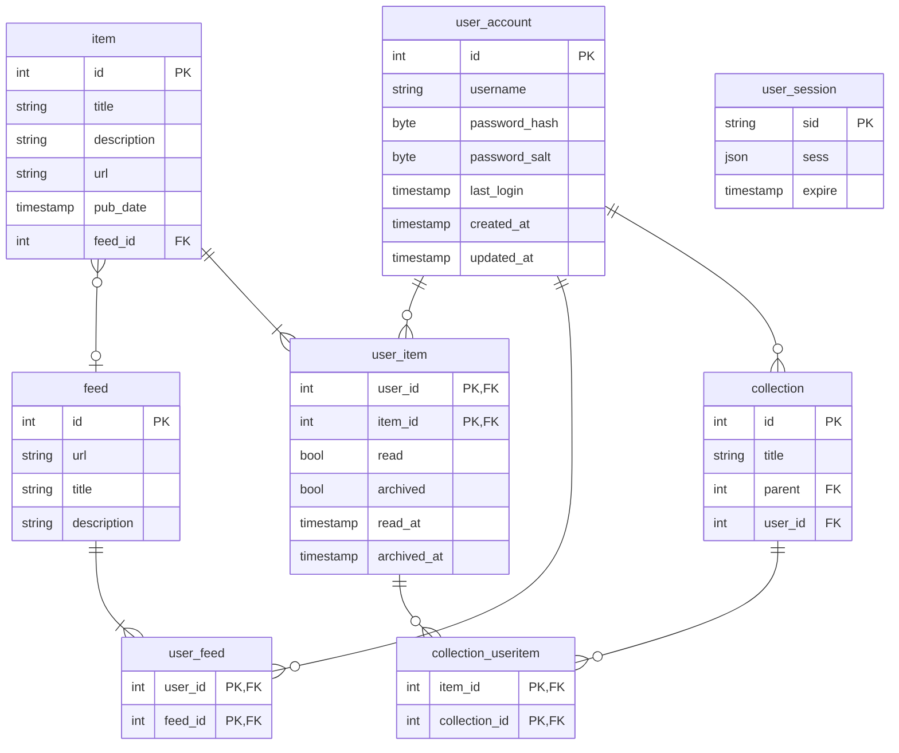

# Data Model

```mermaid
erDiagram
  collection {
	  int id PK
	  string title
	  int parent FK
	  int user_id FK
	}
	feed {
		int id PK
		string url
		string title
		string description
	}
	item {
		int id PK
		string title
		string description
		string url
		timestamp pub_date
		int feed_id FK
	}
	user_account {
		int id PK
		string username
		byte password_hash
		byte password_salt
		timestamp last_login
		timestamp created_at
		timestamp updated_at
	}
	user_session {
		string sid PK
		json sess
		timestamp expire
	}
	collection_useritem {
		int item_id PK,FK
		int collection_id PK,FK
	}
	user_feed {
		int user_id PK,FK
		int feed_id PK,FK
	}
	user_item {
		int user_id PK,FK
		int item_id PK,FK
		bool read
		bool archived
		timestamp read_at
		timestamp archived_at
	}
	
	item zero or many -- zero or one feed : ""
	user_item one -- zero or more collection_useritem : ""
	item one -- one or more user_item : ""

	user_account one -- zero or more user_item  : ""
	user_account one -- zero or more user_feed  : ""
	user_account one -- zero or more collection : ""
	
	feed one -- one or more user_feed : ""
	
	collection one -- zero or more collection_useritem : ""
```
